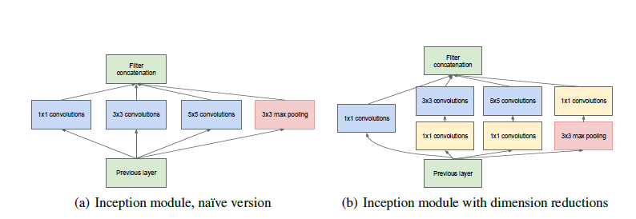
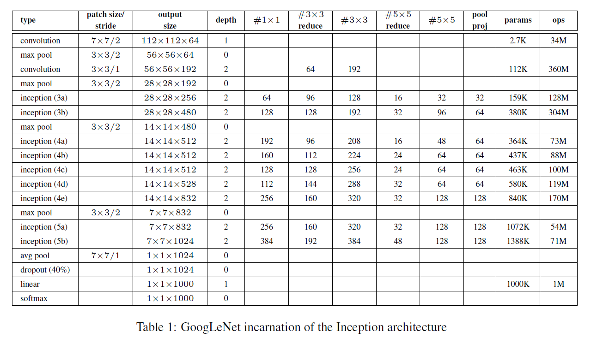

### Going deeper with convolutions

DOI：10.1109/CVPR.2015.7298594   Computer Vision and Pattern Recognition

年份：2014

#### Abstract:

​        作者在本文中提出了一个深度卷积神经网络架构叫做Inception，它是为了在ILSVRC14比赛中进行**图像识别**和**目标检测**的任务。这种架构的特点是更好的改善了网络中的计算资源的利用，可以在**增加网络深度和宽度的情况下而保持计算开支为一个常数**。GoogLeNet是一个22层的网络，作者在分类与检测任务中检测了它的性能。

#### 1.Introduction

​        近年来由于**卷积神经网络**的发展，图像识别和目标检测发展迅速。这些进步不仅是更强大硬件、更大数据集或者更大网络模型，还有一些列新的想法，算法还有改进网络结构。GoogLeNet比AlexNet少12x的参数，但是却比他更精确。目标检测的最大进步不仅仅是更深的网络或者更大的模型，而是将**深度架构**与**计算机视觉**结合，比如像R-CNN一样。

​        另一个重要的因素是我们的算法由于移动和嵌入式计算的发展而变得更加有效。值得注意的本篇文章中的架构是经过思考的，而不仅仅是有一个精确度上的提升。文中设计的架构计算开支可以达到**1.5M次加-乘**，不仅仅是在学术上提高精确度，而且可以推广到真实世界使用。即使在一个很大的数据集上，它也能保持一个合理的开销。

​        “深”有两层含义，一个是“Inception” 模块达到了一个新的水平，另一个是比较直观的意思，网络的深度越来越大。在ILSVRC14上，GoogLeNet的表现确实比目前最先进的网络更出色。

#### 2.Related Work

​        从LeNet5开始，卷积神经网络一般有一个标准的结构--堆叠卷积神经网络（也可以后面跟着正则化或者最大池化），最后是全连接网络。基于基本设计的变体开始在论文中流行起来，并且在基本数据集中表现出色。对于更大的网络，最近的趋势是增大层数和每层中的单元数，并且使用dropout来解决过拟合的问题。

​        尽管担心最大池化会丢失空间精度信息，像AlexNet类似的网络已经用来做定位、检测和人类姿势估计。有些人利用不同规格的过滤器来处理不同大小的图片，像Inception模块类似。然而不像两层固定的模型，Inception中所有模块是学习得到的。此外Inception模块重复多次，就得到了22层的GoogLeNet。

​        Network-in-Network是为了提高神经网络表达力而提出的。当使用卷积神经网络的时候，它会被当做额外的1x1卷积网络放在ReLU激活函数之前，这样可以使它很容易的在CNN整个管道中继承，我们使用了很多这样的网络。在我们的设计中，1x1的网络有双重的目的，最重要的是他可以主要用来实现降维来消除计算瓶颈，否则就会限制我们网络的大小。这样不但可以提高深度，并且可以提高广度而没有性能上的损失。

​        目前最主流的目标检测是R-CNN，它把整个检测问题分为两部分：首先以与类别无关的方式将低级提示（例如颜色和超像素一致性）用于潜在的对象建议，然后使用CNN证实在这些地方的对象类别。这个方法权衡了使用低级线索进行边框的精确度和目前最精确的卷积网络的分类能力。我们改造了一个类似的管道在我们的分类中，但是在两部分都进行了改进，例如多边框预测，并且一套完整的边框建议的分类方法。

#### 3.Motivation

​        最直接的方式是增加深度和广度，但是这样会带来两个问题。

​        更大的网络意味着更多参数，很有可能会过拟合，特别是在训练集有限的情况下。这可能会成为一个很大的瓶颈，因为高质量数据集的创建可能会很艰难并且昂贵，特别是那些需要人类专家才能分辨的那些东西。

​        另一个缺点是是网络规模的扩大会需要大量的计算资源，资源利用不得当很多资源可能会被浪费。因为在实际情况中，计算资源总是有限的，所以不能盲目的增大网络的规模。

​        解决两个问题最基本的方式是使用稀疏连接网络代替全连接网络。此外模仿生物学系统的也会有很多优势因为前人的工作，他们的主要结果表明，当数据集被一个特别大、特别稀疏的神经网络表示的时候，优化网络的拓扑结构就可以通过分析最后一层的激活函数的相互关联的统计和高关联输出的分类神经元而建立起来。即使这种证明需要很严格的条件，但是我们也可以在实际中应用他们。

​        在不利的方面，现在的计算基础设施当涉及在非正态分布的数据结构上的计算的时候是非常无效的。即使算术运算的数量减少了100，查找和缓存未命中的开销仍然占主导地位，以至于切换到稀疏矩阵都不会奏效。通过使用稳定改进的，经过高度调整的数值库，利用底层CPU或GPU硬件的微小细节，可以实现极快的密集矩阵乘法，从而进一步拉大了差距。而且，非均匀的稀疏模型需要更复杂的工程和计算基础结构。当前大多数面向视觉的机器学习系统仅通过使用卷积就在空间域中利用稀疏性。但是，卷积被实现为到较早层中补丁的密集连接的集合。结构的均一性和大量的过滤器以及更大的批量使得可以利用高效的密集计算。

​         这就提出了一个问题，即下一步是否有希望：一种架构，如理论所建议的那样，利用了额外的稀疏性，即使在滤波器级别也是如此，但是通过利用密集矩阵的计算来利用我们当前的硬件。关于稀疏矩阵计算的大量文献表明，将稀疏矩阵聚类为相对密集的子矩阵往往会为稀疏矩阵乘法提供最新的实用性能。 认为不久的将来将采用类似的方法来自动构建非统一的深度学习架构似乎并不为过。

​        Inception体系结构最初是作为第一作者的案例研究进行的，该案例旨在评估复杂网络拓扑构造算法的假设输出，该算法试图逼近[2]所暗示的稀疏结构，用于视觉网络，并通过密集，容易地覆盖假设的结果可用组件。尽管这是一个高度投机的工作，但仅在对拓扑的确切选择进行两次迭代之后，我们已经可以看到相对于参考体系结构的适度收益。在进一步调整学习率，超参数和改进的训练方法之后，我们确定了所得的Inception体系结构在定位和对象检测（作为[6]和[5]的基础网络）中特别有用。 有趣的是，尽管大多数原来的结构的选择都受到了质疑和测试，但事实证明它们至少是局部最优的。

​        但是，必须谨慎：尽管所提议的体系结构已经成功地实现了计算机视觉，但是否可以将其质量归因于以下方面的指导原则仍然值得怀疑：导致其建设。 确保将需要进行更彻底的分析和验证：例如，基于以下所述原理的自动化工具是否可以找到相似的地方，但是视觉网络的更好拓扑。 最有说服力的证据是自动化系统是否会创建网络拓扑，从而在使用相同域的其他域中获得相似的收益算法，但全局架构看起来却大不相同。 至少，Inception架构的最初成功为沿着这个方向激动人心的未来工作提供了坚定的动力。

#### 4.Architectural Details

Inception体系结构的主要思想是基于找出卷积视觉网络中最佳局部稀疏结构的近似值，并通过易于使用的密集组件来覆盖它。请注意，假设平移不变意味着我们的网络将由卷积构建块构建。我们所需要做的就是找到最佳的局部构造并在空间上进行重复。[2]提出了一种逐层的结构，其中应该分析最后一层的相关统计量并将其聚类为具有高度相关性的单元组。这些群集形成下一层的单元，并连接到上一层的单元。我们假设来自较早层的每个单元对应于输入图像的某些区域，并且这些单元被分组为滤镜组。在较低的层（靠近输入层），相关单元将集中在局部区域。这意味着，我们最终将聚集在单个区域中的许多簇，它们可以在下一层由1 x 1卷积的一层覆盖，如[12]中所建议。但是，人们也可以预期，在较大的斑块上可以通过卷积覆盖的空间分布更分散的簇数量会更少，而在越来越大的区域上，斑块的数量将会减少。为了避免补丁对齐问题，Inception体系结构的当前版本仅限于过滤器大小1x1、3x3和5x5，但是此决定更多地基于便利性而非必要性。另外，由于池化操作对于当前最先进的卷积神经网络的成功至关重要，因此建议在每个这样的阶段中添加替代并行池化路径也应该具有额外的有益效果。

由于这些“Inception模块”彼此堆叠，因此它们的输出相关性统计信息必然会发生变化：随着更高层捕获更高抽象的特征，预计它们的空间集中度会降低，表明3x3与 5x5卷积应该随着我们移到更高的层而增加。

至少以这种简单形式，上述模块的一个大问题是，即使是数量有限的5 5卷积，在具有大量过滤器的卷积层之上也可能是昂贵的。 一旦将池单元添加到混合中，此问题将变得更加明显：它们的输出过滤器数量等于上一阶段的过滤器数量。 合并层的输出与卷积层的输出的合并将导致不可避免地增加每个阶段的输出数量。即使此架构可能涵盖了最佳的稀疏结构，这样做会非常无效率，从而导致内部的几个阶段计算爆炸。

这导致了所提出的体系结构的第二个想法：明智地在任何情况下如果计算需求会增加太多的地方进行尺寸缩减和投影。这是基于嵌入的成功：即使是低维的嵌入也可能包含许多有关较大图像补丁的信息。 但是，嵌入表示密集，压缩的形式和压缩的信息很难建模。 我们希望在大多数情况下保持表示稀疏（根据[2]的条件要求）并压缩仅在必须将它们汇总时才发出信号。 也就是说，在昂贵的3x3和5x5卷积之前，使用1x1卷积来计算减少量。除了用作减少量外，它们还包括使用整流线性激活，使其具有双重用途。 最终结果如图2（b）所示

通常，Inception网络是由彼此堆叠的上述类型的模块组成的网络，偶尔具有最大步距为2的最大池化层，以将网格的分辨率减半。 出于技术原因（训练期间的内存效率），似乎仅在较高的层开始使用Inception模块，而以传统的卷积方式保留较低的层似乎是有益的。 这不是严格必要的，只是反映了我们当前实施中的一些基础设施效率低下。

该体系结构的主要优点之一是，它可以显着增加每个阶段的单元数，而不会导致计算复杂性的急剧增加。 普遍使用降维功能可以将最后一级的大量输入滤波器屏蔽到下一层，首先缩小其尺寸，然后再以较大的补丁尺寸对它们进行卷积。 此设计的另一个实际有用的方面是，它与直觉一致，即视觉信息应在不同的比例下进行处理，然后进行汇总，以便下一阶段可以同时从不同的比例抽象特征。

改进的计算资源使用可以增加每个阶段的宽度以及阶段数，而不会引起计算困难。 利用初始架构的另一种方法是创建稍逊一筹但在计算上更便宜的版本。 我们发现，所有随附的旋钮和操纵杆都可以实现计算资源的受控平衡，与使用非盗版架构的类似性能的网络相比，可以使网络的运行速度快2 however3，但是这时需要仔细的手动设计。

#### 5.GoogLeNet

之所以选择GoogLeNet的原因是为了想LeNet5致敬。我们还使用了更深入，更广泛的Inception网络，其质量略逊一筹，但是将其添加到整体中似乎可以稍微改善结果。我们省略了该网络的细节，因为我们的实验表明，确切的体系结构参数的影响相对较小。

此处，出于演示目的，表1中描述了最成功的特定实例（名为GoogLeNet）。 在我们的合奏中，对7个模型中的6个使用了完全相同的拓扑（使用不同的采样方法进行训练）。

所有卷积，包括Inception模块内部的那些卷积，均使用ReLu线性激活。我们网络中的视野域大小为224x224，其中RGB颜色通道与均值相减。“＃3x3 reduce”和“＃5x5 reduce”代表在3x3和5x5卷积之前使用的约简层中1x1过滤器的数量。 可以看到投影中1x1个滤镜的数量池proj列中内置的最大池化之后的第二层。 所有这些缩小/投影层也都使用ReLu线性激活。

该网络设计经过了精心设计，在计算能力比较差的网络上也可以使用。当我们不计池化层的时候，网络有22层，整个网络的构建用了大约100个，然而网络层数很依赖用的电脑的计算资源。在分类器前使用一个平均池化基于[12 network in network论文中最重要的两个贡献：1.在分类器前使用全局平均池化2.1x1卷积网络的使用]，但是我们的不同在于使用了一个额外的线性层，这个可以使我们的网络很容易去使用其他的标签。这使我们可以轻松地针对其他标签集对我们的网络进行调整和微调，但这主要是方便，**我们并不期望它会产生重大影响**。(加一个平均池化是不是只是容易进行泛化而不是进行)。使用平均池化后提高了top-1的错误率，然而的droupout的使用时必须的。

一个深度较大较大的网络，如何进行有效的往回传播梯度是一个要考虑的问题。一个有趣的见解是，相对较浅的网络在此任务上的强大性能表明，网络中间各层所产生的功能应非常有区别。通过添加连接到这些中间层的辅助分类器，我们希望能够鼓励在分类器的较低级进行区分，增加被传播回去的梯度信号，并提供附加的正则化。这些分类器采用较小的卷积网络的形式，位于Inception（4a）和（4d）模块的输出之上。在训练过程中，它们的损失将以折扣权重添加到网络的总损失中（辅助分类器的损失加权为0.3）。 在推断时，将丢弃这些辅助网络。

侧面的额外网络（包括辅助分类器）的确切结构如下

* 平均池化层具有5x5的过滤器大小和3的步幅，输出为4x4x512（4a）阶段为4x4x528，（4d）阶段为4x4 x528。

* 1x1卷积然后是128个过滤器用于降维，然后使用线性激活函数

* 1024个单元的全连接层，使用ReLU线性激活函数

* dropout层使用70%的丢失率

* 一个线性层最后使用一个softmax作为分类器

#### 6.Training Methodology

#### 7.ILSVRC 2014 Classification Challenge Setup and Results

#### 8.ILSVRC 2014 Detection Challenge Setup and Results

#### 9 Conclusions